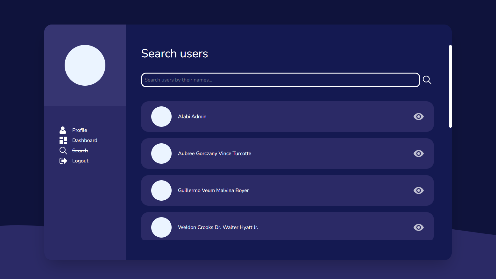

# Al&Bee

> Modern tool for user management

<p align="center">
  
</p>

Al&Bee lets you keep track of user records in an easy way. It provides 
simple-to-adopt interface to use it with joy!

## Getting started
### Prerequisites
You should first install required software to run Al&Bee. These include:
- MySql database server and Apache server (recommend [__XAMPP__](https://www.apachefriends.org/download.html));
- [PHP runtime](https://www.php.net/downloads)
- [Composer](https://getcomposer.org/download/)

### Configuration
Rename file [```.env.example```](./.env.example) to ```.env```. Then change variable values to how you need.
For the most part, you should only change:
- ```DB_HOST``` - ip of MySQL server,
- ```DB_PORT``` - port of MySQL server,
- ```DB_DATABASE``` - name of MySQL database,
- ```DB_USERNAME``` - username of MySQL database,
- ```DB_PASSWORD``` - username's password of MySQL database,
- ```APP_KEY``` - application encryption key, which can be generated using ```php artisan key:generate```,
- ```DB_SEEDER_USER_PASSWORD``` - password of Al&Bee admin.
If you use XAMPP, you can leave ```DB_HOST``` and ```DB_PORT``` to their default values.

### Installation
Clone the project using ```git clone https://github.com/dbelik/Al-Bee.git```.
Install packages via ```npm install``` and ```composer install```.
Create database (in phpMyAdmin, if you use it) with name = ```DB_DATABASE```.
Run ```php artisan migrate``` to run database migations.

### Running
Run ```npm run hot``` and ```php artisan serve```. Artisan will output the URL address where the website is running.

## License
Al&Bee uses [Apache License 2.0](./LICENSE)
